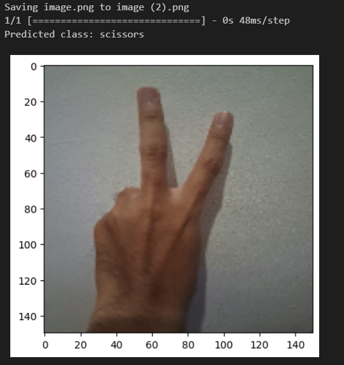

# rock-paper-scissors image classification model
 
It's a machine learning project to complete the Dicoding class, with the following requirements:
1. Model accuracy above 85%.
2. Using more than 1 hidden layer.
3. Applying more image augmentation.
4. Using an optimizer and loss function not taught in the class.

